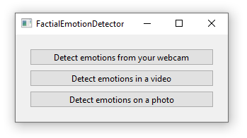
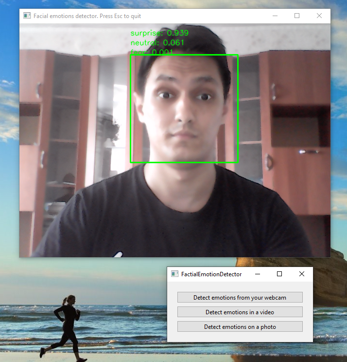
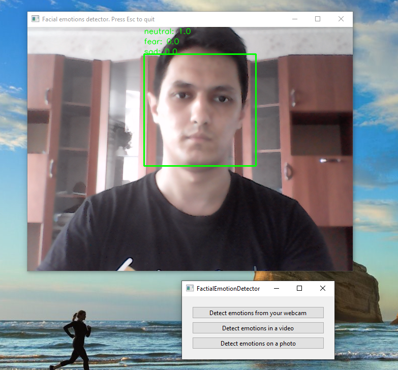
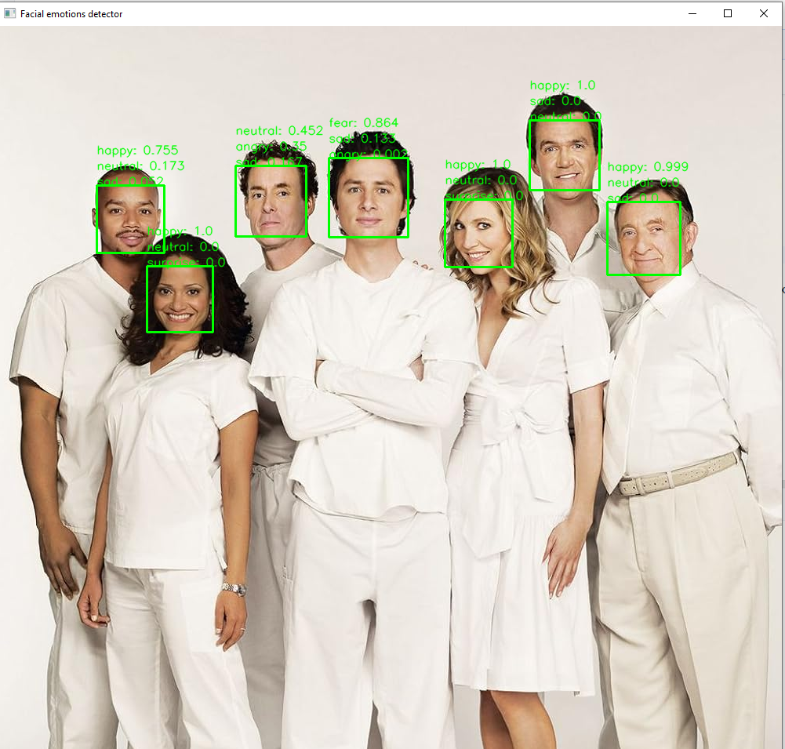

# Как использовать?
1. Убедиться, что в вашем виртуальном окружении python (venv) имеются необходимые библиотеки из requirements.txt. Те, что находятся под #required - необходимы для запуска скрипта main.py, а те что под #optional можно установить по желанию если нужно посмотреть на пайплайн обучения модели
2. Далее перейти в папку с проектом, активировать виртуальное окружение venv, в которое вы устанавливали библиотеки и в терминале написать
```python
python main.py
```
после чего откроется графическое окно



если вы хотите запустить детекцию эмоций с веб-камеры, то в появившемся окне выберите **Detect emotions from your webcam**

если вы хотите запустить детекцию с видео то **Detect emotions in a video**

если вы хотите запустить детекцию на фото то **Detect emotions on a photo**

Программа может распознавать 7 видов эмоций:
1. angry
2. disgust
3. fear
4. happy
5. neutral
6. sad
7. surprise

Пример работы программы:
```python
python main.py
```





В файле TrainModelFER2013.ipynb вы можете посмотреть пайплайн для обучения детектора эмоций
Был использован датасет который вы можете найти по ссылке https://www.kaggle.com/datasets/jonathanoheix/face-expression-recognition-dataset
 
Был использован python 3.12.7